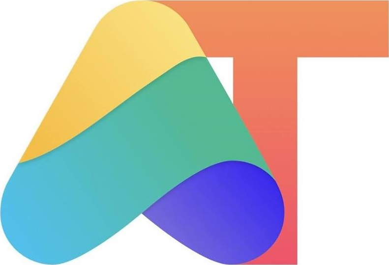

  

<h1 align="center">Fórum</h1>

Discussões em formato de issues - Agile Testers

  
   

<h3 align="center">
  <a href="https://agiletesters.com.br/">🌐Site Oficial</a>
   · 
    <a href="https://anchor.fm/qansei">🎧Podcast QAnsei</a>
   · 
  <a href="https://medium.com/assertqualityassurance">📚Medium assert(QA)</a>
</h3>

## 🤖 Navegue

- [O Agile Testers](#dart-o-agile-testers)
- [Canais](#movie_camera-canais)
- [Código de conduta](#rotating_light-código-de-conduta)
- [Vagas](#heart-vagas)
- [Licença](#memo-licença)

## :dart: O Agile Testers

O Agile Testers está completando 7 anos e nessa caminhada tem contribuído com bastante conteúdo e eventos para a comunidade brasileira de teste e qualidade. Para comemorar nosso aniversário, estamos modificando um pouco as plataformas que usamos para cada vez mais conseguir atingir os profissionais brasileiros trazendo discussões de qualidade e contribuindo para a comunidade.

## :movie_camera: Canais

Hoje o AT está em diferentes canais, são eles:

- [Podcast](https://anchor.fm/qansei)

- [Site Oficial](https://agiletesters.com.br/)

- [Youtube](https://www.youtube.com/channel/UChHLl66ov4h2hmL_G3hHi3Q)

- [Medium](https://medium.com/assertqualityassurance)

## :rotating_light: Código de conduta

Este Código de Conduta será aplicado para todos enquanto participantes dessa comunidade para proteger o público de danos e perigos morais.

Nos dedicamos a promover um espaço respeitoso e livre de assédio para todos. Não toleramos qualquer forma de assédios ou intimidações de qualquer participante.

Não devem utilizar imagens, atividades ou materiais de conteúdo sexual, homofóbico, pejorativo e/ou discriminatório de qualquer natureza.

Por assédio entende-se sem limitação:

* Comentários ofensivos, verbais ou eletrônicos, relacionados a características pessoais, origem racial, orientação sexual, identidade de gênero, bem como comentários ou imagens sexuais, racistas, homofóbicas ou discriminatórias de qualquer natureza em espaços públicos ou digitais;
* Intimidação deliberada;
* Bullying;
* Perseguição;
* Encalço;
* Fotografias ou gravações que gerem embaraço;
* Interrupções reiteradas de palestras, bate-papos, reuniões eletrônicas, reuniões físicas ou outros eventos;
* Contato físico inadequado ou atenção sexual indesejada.

Você pode ver mais detalhes sobre nosso código de conduta [aqui](./codigo-de-conduta.md).

## :heart: Vagas

Nós apoiamos o [QA Brasil Vagas](https://github.com/qa-brasil/vagas) onde você encontra vagas de QA em todas as regiões do país.

## :memo: Licença

Este projeto está sobre a [licença MIT](./LICENSE).
